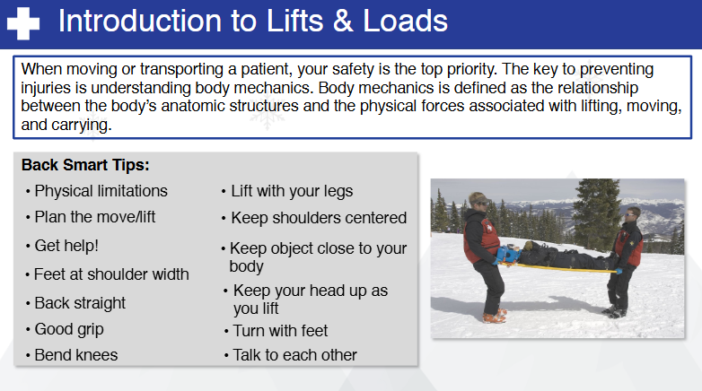
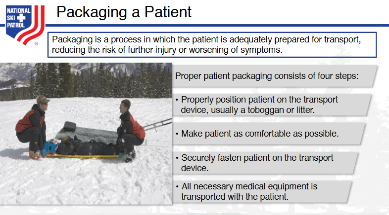

# Nsp Oec Training Chapter 5 - National Ski Patrol - Outdoor Emergency Care chapter 5
National Ski Patrol - Outdoor Emergency Care chapter 5

Chapter 5: Moving, Lifting, and Transporting Patients

1. Explain how to use good body mechanics.
2. Demonstrate the power grip and power lift. 
3. Demonstrate the moves that can be used when there is not a spinal injury.
4. Demonstrate the moves that can be used when you suspect a spinal injury.
5. Demonstrate urgent moves.
6. Demonstrate non-urgent moves.
7. Describe and demonstrate the use of devices for lifting and moving patients.
8. Discuss how you place a patient in a toboggan while protecting the injury.
9. Explain the purpose and correct steps of packaging a patient.
10. Explain a landing zone and proper helicopter safety.

##5.1  Explain how to use good body mechanics.

When lifting an injured skier, especially in a situation where they may have sustained injuries like fractures, sprains, or dislocations, it is critical to use **proper body mechanics** and ensure that the **injury is stabilized** before moving the patient. The focus should be on **preventing further injury** to both the skier and the rescuer.

Here’s a step-by-step guide to lifting an injured skier while using **good body mechanics**:

---

### **Steps for Lifting an Injured Skier**

#### **1. Assess the Scene for Safety**
   - **Ensure scene safety**: Before approaching the skier, make sure the area is free from hazards like moving skiers, unstable snow, or unsafe terrain.
   - **Call for help**: If the injury appears serious (e.g., fractures, head injury, spinal injury), call **ski patrol** or emergency medical services immediately. Avoid moving the skier unnecessarily.

#### **2. Assess the Skier’s Condition**
   - **Assess the injury**: Determine the extent of the injury. If the skier has a suspected fracture, spinal injury, or head injury, avoid moving them until professional help arrives.
   - **Immobilize the injury**: If you suspect a fracture, **immobilize the injured limb** before attempting to lift or move the skier. Use a **rigid splint** or any available materials (e.g., ski poles, padding) to stabilize the limb.

#### **3. Plan the Lift**
   - If the skier can assist (e.g., they have a minor injury like a sprained ankle), **talk to them** and instruct them on how to help with the lift.
   - If possible, **recruit help** from others to distribute the weight and ensure safety.
   - **Assess the terrain**: Make sure you are on stable ground with good footing, especially if you are in deep snow or on uneven terrain.

#### **4. Use a Wide Base of Support**
   - Stand with your **feet shoulder-width apart** to create a stable base.
   - Position one foot slightly ahead of the other to help maintain balance while lifting, especially if the terrain is uneven or slippery.

#### **5. Bend Your Knees, Not Your Back**
   - **Squat down** by bending your knees and hips, keeping your back straight. Do not bend at the waist.
   - Keep your spine in a **neutral, upright position** to avoid strain on your back.

#### **6. Keep the Skier Close to Your Body**
   - If you are physically lifting the skier, keep them **as close to your body** as possible to reduce the strain on your back and arms.
   - **Avoid reaching or stretching**: Reaching out puts extra pressure on your spine, increasing the risk of injury.

#### **7. Engage Your Core Muscles**
   - Tighten your **abdominal muscles** to provide additional support for your lower back and spine while lifting.
   - Maintain your core engagement throughout the entire lifting process to stabilize your body.

#### **8. Lift with Your Legs**
   - **Straighten your knees and hips** to lift the skier, using the strength of your leg muscles, not your back.
   - Keep your back straight and **do not twist** while lifting. If you need to change direction, **pivot your feet** rather than turning your torso.

#### **9. Use Smooth, Controlled Movements**
   - Lift the skier slowly and smoothly. Avoid jerking motions or rapid movements, which could cause injury to both you and the skier.
   - **Communicate with the skier**: Let them know what you're doing and ask them to assist as much as they can.

#### **10. Avoid Twisting and Bending**
   - When moving the skier, **do not twist your spine**. If you need to turn, pivot your feet and move your entire body in the direction you’re heading.
   - If multiple rescuers are involved, ensure everyone is moving in the same direction to avoid twisting the skier’s body and worsening any potential injuries.

#### **11. Lower the Skier with Care**
   - When lowering the skier to the ground or into a more stable position (e.g., onto a toboggan or stretcher), **bend your knees and lower yourself** with your legs.
   - **Keep the skier close to your body** throughout the process to maintain control and avoid straining your back.

#### **12. Use Assistance When Needed**
   - If the skier is heavy or the terrain is difficult, **ask for help** from others or use appropriate equipment, such as a **ski patrol toboggan**, to transport the skier.
   - Mechanical devices or team lifting reduce the risk of injury and ensure the skier’s safety.

---

### **Demonstration Example: Lifting an Injured Skier with a Leg Injury**

#### **Scenario**:
A skier has fallen and appears to have injured their leg. They are unable to stand on their own and need assistance being lifted and moved off the slope.

#### **Steps**:
1. **Assess the situation**:
   - Check for signs of a fracture, dislocation, or other injuries.
   - If the injury seems severe, call **ski patrol** or emergency services, and avoid moving the skier until help arrives.

2. **Immobilize the leg**:
   - If the injury is suspected to be a fracture, apply a **splint** to the injured leg using available materials (e.g., ski poles padded with jackets or other soft items).
   - Ensure that the leg is stabilized before attempting to move or lift the skier.

3. **Prepare for the lift**:
   - If possible, **recruit another person** to assist in lifting the skier.
   - Stand with your **feet shoulder-width apart** and bend your knees to get into position.
   - Position one foot slightly in front of the other to maintain balance.

4. **Communicate with the skier**:
   - Tell the skier what you’re about to do and encourage them to assist by pushing up with their arms if possible.

5. **Lift with your legs**:
   - **Hold the skier close to your body** to reduce strain.
   - **Straighten your knees and hips** to lift, using the strength of your legs, and keep your back straight.
   - Avoid twisting or jerking movements.

6. **Lower with control**:
   - If you are moving the skier to a safe position (e.g., to a stretcher or toboggan), lower them gently by **bending your knees** and keeping them close to your body.

7. **Seek medical help**:
   - Ensure the skier is safely transported off the slope and to medical attention.

---

### **Key Principles of Good Body Mechanics for Lifting an Injured Skier**:
- **Assess the scene** and the skier’s condition before moving them. Immobilize any suspected fractures.
- **Use a wide base of support** by standing with feet shoulder-width apart.
- **Bend your knees, not your back**, and lift with your legs to prevent back injuries.
- **Keep the skier close** to your body to reduce strain on your back and arms.
- **Avoid twisting**: Pivot with your feet, not your spine.
- **Communicate** with the skier and others helping you lift.
- **Ask for help** if the skier is too heavy or the terrain is difficult.

By following these steps, you can safely lift an injured skier while minimizing the risk of injury to yourself and ensuring the safety of the skier.

##5.2. Demonstrate the power grip and power lift. 
##5.3. Demonstrate the moves that can be used when there is not a spinal injury.
##5.4. Demonstrate the moves that can be used when you suspect a spinal injury.
##5.5. Demonstrate urgent moves.
##5.6. Demonstrate non-urgent moves.
##5.7. Describe and demonstrate the use of devices for lifting and moving patients.
##5.8. Discuss how you place a patient in a toboggan while protecting the injury.
##5.9. Explain the purpose and correct steps of packaging a patient.
##5.10. Explain a landing zone and proper helicopter safety.

## Key Terms 
 1. **Body Mechanics** - The use of proper posture and techniques to prevent injury when lifting or moving patients. 
  2. **Carry** - A method of transporting a patient by lifting and supporting them using both hands or a device. 
  3. **Drag** - A technique used to move a patient by pulling them, often used when speed is necessary, such as in emergencies. 
  4. **Landing Zone** - A designated area where a medical helicopter can safely land to transport patients or provide emergency care. 
  5. **Lift** - A method of raising a patient off the ground or bed, often requiring proper body mechanics to prevent injury. 
  6. **Move** - The act of relocating a patient from one position to another, which may involve carrying, dragging, or lifting. 
  7. **Spinal Motion Restriction** - The process of limiting movement of the spine in patients with suspected spinal injuries to prevent further damage. 
 

## Getting Started
To get started with the **Nsp Oec Training Chapter 5** solution repository, follow these steps:
1. Clone the repository to your local machine.
2. Install the required dependencies listed at the top of the notebook.
3. Explore the example code provided in the repository and experiment.
4. Run the notebook and make it your own - **EASY !**
    
## Solution Features
- Easy to understand and use  
- Easily Configurable 
- Quickly start your project with pre-built templates
- Its Fast and Automated

## Notebook Features
- **Self Documenting** - Automatically identifes major steps in notebook 
- **Self Testing** - Unit Testing for each function
- **Easily Configurable** - Easily modify with **config.INI** - keyname value pairs
- **Includes Talking Code** - The code explains itself 
- **Self Logging** - Enhanced python standard logging   
- **Self Debugging** - Enhanced python standard debugging
- **Low Code** - or - No Code  - Most solutions are under 50 lines of code
- **Educational** - Includes educational dialogue and background material
    
## Deliverables or Figures
       
    

## Github    https://github.com/JoeEberle/ 
## Email  josepheberle@outlook.com 

    

    